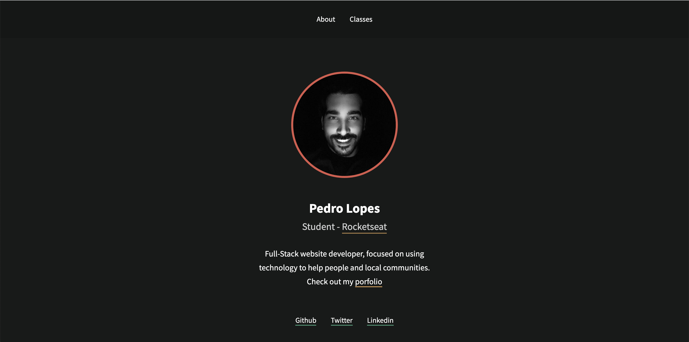

<h4 align="center">
<br>
 <b>Portfolio Template</b> 👨‍💻
</h4>
<p align="center">
  

  
  
  <a href="#">
    </a>

  <a href="#">
    </a>
    
  <a href="https://pedroclopes.com">
    </a>
    
</p>

<br>

### :rocket: Tecnologias usadas

This project was developed using the following languages:

* [HTML](https://devdocs.io/html/)
* [CSS](https://devdocs.io/css/)
* [Javascript](https://devdocs.io/javascript/)

### 💻 Projeto

This <b>Portfolio</b> was developed during the Rocketseat bootcamp during the front-end module.

### Pré-requisitos

Before you start, you will need to install in your machine the following tools:

<b>[Git](https://git-scm.com)</b>

You will also need an editor, I recommend <b>[VSCode](https://code.visualstudio.com/)</b>

### 🧭 Rodando 

```bash
# Clone this repo
$ git clone https://github.com/gitpcl/project-1

# Access the dir of the project in your terminal
$ cd project-1
```
### :floppy_disk: Como contribuir

- Fork this repo;
- Create a branch with your feature: `git checkout -b my-feature`
- Commit your changes: `git commit -m 'feat: My new feature'`
- Push your branch: `git push origin my-feature`

After the merge of your pull request is done , you can delete your branch.

### :mortar_board: Who was the instructor?

The instructor for this module was [Myke Brito](https://github.com/maykbrito)

### :memo: License

This project is under the MIT. Check out the file [LICENSE](LICENSE) for more details.

### 📱 Social

Me acompanhe nas minhas redes sociais.

<p align="center">

   <a href="https://github.com/gitpcl" target="_blank" >
    </a>
    
   <a href="https://twitter.com/lcpedro" target="_blank" > 
     </a> 
  
  <a href="https://instagram.com/pcl_hou" target="_blank" >
    </a> 

  <a href="https://www.linkedin.com/in/pedro-c-lopes/" target="_blank" >
    </a> 
  
  <a href="mailto:hello@pedroclopes.com" target="_blank" >
    </a> 
  
</p>

---

Made with ❤️  by **Pedro Lopes** 🤙